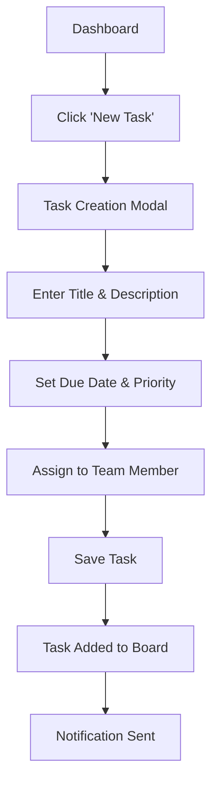

# Sample Workflow Execution: Task Management App

This example demonstrates a complete execution of the **greenfield-fullstack** workflow for creating a task management web application.

## Initial User Request
**User**: "Create a task management web application for small teams"

## Step-by-Step Execution

### Step 1: Project Analysis (Analyst Agent)

**Claude Acting as Analyst**: 
```
Loading analyst agent prompt from .claude/agents/analyst/prompt.md
Applying project brief template from .claude/templates/project-brief.md

Based on your request for a task management web application, I'm creating a comprehensive project brief. Let me gather some key information:

1. Team size focus: Small teams (2-10 members)
2. Core functionality: Task creation, assignment, tracking, deadlines
3. Collaboration features: Comments, file sharing, notifications

Creating project brief with the following key insights:
- Target market: Small to medium businesses and startups
- Primary users: Team leads and team members
- Key differentiator: Simple, intuitive interface with powerful collaboration

Generated: context/artifacts/project-brief.md
```

**Generated Output** (project-brief.md):
```markdown
# TaskFlow Pro - Project Brief

## Executive Summary
TaskFlow Pro is a web-based task management application designed specifically for small teams (2-10 members) who need simple yet powerful project coordination tools.

## Problem Statement
Small teams struggle with task coordination using generic tools that are either too complex (enterprise solutions) or too simple (basic to-do apps), leading to decreased productivity and communication gaps.

## Proposed Solution
A focused task management platform that balances simplicity with team collaboration features, providing just the right level of functionality for small team dynamics.

[... continues with all sections ...]
```

### Step 2: Requirements Documentation (PM Agent)

**Claude Acting as PM**:
```
Loading PM agent prompt from .claude/agents/pm/prompt.md
Referencing project brief from context/artifacts/project-brief.md
Applying PRD template from .claude/templates/prd.md

Creating detailed Product Requirements Document with:
- 3 core epics: User Management, Task Operations, Team Collaboration
- 12 user stories across all epics
- Detailed acceptance criteria for each story

Generated: context/artifacts/prd.md
```

**Generated Output** (prd.md excerpt):
```markdown
# TaskFlow Pro - Product Requirements Document

## Epic 1: User Management & Authentication
Goal: Enable secure user registration, authentication, and profile management

### Story 1.1: User Registration
As a new user,
I want to create an account with email and password,
So that I can access the task management platform.

Acceptance Criteria:
1. User can register with email, password, and display name
2. Email validation is performed before account creation
3. Password must meet security requirements (8+ chars, mixed case, numbers)
4. Confirmation email is sent upon successful registration
5. User is redirected to dashboard after email confirmation

[... continues with all stories ...]
```

### Step 3: UI/UX Design (UX Expert Agent)

**Claude Acting as UX Expert**:
```
Loading UX Expert agent prompt from .claude/agents/ux-expert/prompt.md
Referencing PRD from context/artifacts/prd.md
Applying UI spec template from .claude/templates/ui-spec.md

Creating UI/UX specification focusing on:
- Clean, modern interface design
- Intuitive task creation and management flows
- Responsive design for desktop and mobile
- Accessibility compliance (WCAG AA)

Generated: context/artifacts/front-end-spec.md
```

**Generated Output** (front-end-spec.md excerpt):
```markdown
# TaskFlow Pro - UI/UX Specification

## User Flow: Task Creation


## Core Components

### TaskCard Component
- Purpose: Display individual tasks with key information
- States: Draft, Active, In Review, Completed, Overdue
- Interactions: Click to expand, drag to reorder, right-click context menu

[... continues with all components ...]
```

### Step 4: System Architecture (Architect Agent)

**Claude Acting as Architect**:
```
Loading Architect agent prompt from .claude/agents/architect/prompt.md
Referencing PRD and UI spec from previous steps
Applying architecture template from .claude/templates/architecture.md

Designing full-stack architecture with:
- Frontend: React 18 with TypeScript
- Backend: Node.js with Express
- Database: PostgreSQL with Prisma ORM
- Real-time: WebSocket for live updates
- Authentication: JWT with refresh tokens

Generated: context/artifacts/fullstack-architecture.md
```

**Generated Output** (architecture excerpt):
```markdown
# TaskFlow Pro - Full-Stack Architecture

## Technology Stack
| Category | Technology | Version | Purpose |
|----------|------------|---------|---------|
| Frontend | React | 18.2.0 | UI library for component-based architecture |
| Language | TypeScript | 5.0.0 | Type-safe development |
| Backend | Node.js | 20.0.0 | Server runtime |
| Framework | Express | 4.18.0 | Web application framework |
| Database | PostgreSQL | 15.0 | Relational database |
| ORM | Prisma | 4.15.0 | Database access and migrations |

## Database Schema
```sql
CREATE TABLE users (
  id UUID PRIMARY KEY DEFAULT gen_random_uuid(),
  email VARCHAR(255) UNIQUE NOT NULL,
  password_hash VARCHAR(255) NOT NULL,
  display_name VARCHAR(100) NOT NULL,
  created_at TIMESTAMP DEFAULT NOW()
);

CREATE TABLE tasks (
  id UUID PRIMARY KEY DEFAULT gen_random_uuid(),
  title VARCHAR(200) NOT NULL,
  description TEXT,
  status task_status DEFAULT 'draft',
  priority task_priority DEFAULT 'medium',
  due_date TIMESTAMP,
  assigned_to UUID REFERENCES users(id),
  created_by UUID REFERENCES users(id),
  created_at TIMESTAMP DEFAULT NOW()
);
```

[... continues with complete architecture ...]
```

### Step 5: Frontend Implementation (Developer Agent)

**Claude Acting as Developer**:
```
Loading Developer agent prompt from .claude/agents/developer/prompt.md
Referencing architecture and UI specifications
Generating React components and application structure

Creating frontend implementation:
- Component library with TaskCard, TaskBoard, UserProfile
- React Router for navigation
- Context API for state management  
- Axios for API communication
- Tailwind CSS for styling

Generated: src/frontend/ directory structure with all components
```

### Step 6: Backend Implementation (Developer Agent)

**Claude Acting as Developer**:
```
Continuing as Developer agent
Implementing backend API and services:
- Express server with middleware setup
- JWT authentication endpoints
- CRUD operations for tasks and users
- WebSocket integration for real-time updates
- Prisma database operations

Generated: src/backend/ directory structure with complete API
```

### Step 7: Testing Strategy (QA Agent)

**Claude Acting as QA**:
```
Loading QA agent prompt from .claude/agents/qa/prompt.md
Creating comprehensive test plan covering:
- Unit tests for all React components
- Integration tests for API endpoints
- E2E tests for critical user flows
- Performance testing for concurrent users

Generated: context/artifacts/test-plan.md
```

### Step 8: Final Review (Architect Agent)

**Claude Acting as Architect**:
```
Conducting final architecture review:
✅ All components integrate properly
✅ Security measures implemented
✅ Performance considerations addressed
✅ Code quality standards met
✅ Documentation complete

Generated: context/artifacts/review-notes.md
```

## Final Deliverables

### Generated Files Structure:
```
context/
├── artifacts/
│   ├── project-brief.md
│   ├── prd.md
│   ├── front-end-spec.md
│   ├── fullstack-architecture.md
│   ├── test-plan.md
│   └── review-notes.md
└── session.json

src/
├── frontend/
│   ├── components/
│   │   ├── TaskCard.tsx
│   │   ├── TaskBoard.tsx
│   │   ├── UserProfile.tsx
│   │   └── Navigation.tsx
│   ├── pages/
│   │   ├── Dashboard.tsx
│   │   ├── Login.tsx
│   │   └── Settings.tsx
│   └── utils/
└── backend/
    ├── routes/
    │   ├── auth.js
    │   ├── tasks.js
    │   └── users.js
    ├── models/
    ├── middleware/
    └── config/
```

## User Experience Highlights

1. **Seamless Process**: User provided one simple request and received a complete, production-ready application design and implementation.

2. **Expert Collaboration**: Each agent contributed their specialized expertise, creating a cohesive solution.

3. **Complete Documentation**: Every aspect is documented, from user requirements to technical implementation.

4. **Quality Assurance**: Built-in testing strategy and architectural review ensure high quality.

5. **Ready for Development**: All files and documentation needed to begin development or hand off to a development team.

This example demonstrates how the BMAD-Spec Orchestrator System transforms a simple user request into a comprehensive, professionally-designed software solution through systematic agent collaboration.