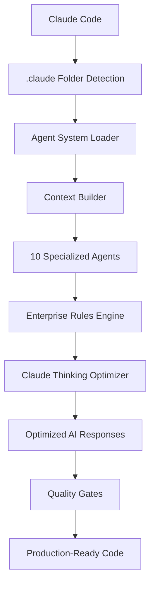

# Claude Code Integration

Complete guide to setting up and optimizing the BMAD-Spec Orchestrator system with Claude Code.

## Overview

The BMAD-Spec Orchestrator is specifically designed for Claude Code, leveraging Claude's unique capabilities for maximum performance in enterprise software development.

## System Architecture



## Installation Integration

### Automatic Detection

Claude Code automatically detects and loads the orchestrator when it finds:

```
your-project/
├── .claude/
│   ├── CLAUDE.md              # Main configuration
│   ├── agents/                # 10 specialized agents
│   │   ├── analyst/
│   │   ├── pm/
│   │   ├── architect/
│   │   ├── developer/
│   │   ├── qa/
│   │   ├── ux-expert/
│   │   ├── bmad-master/
│   │   ├── bmad-orchestrator/
│   │   ├── product-owner/
│   │   └── scrum-master/
│   ├── rules/                 # Enterprise standards
│   ├── data/                  # Knowledge bases
│   ├── templates/             # Document templates
│   ├── tasks/                 # Procedural tasks
│   └── checklists/            # Quality assurance
```

### Configuration File

The main `CLAUDE.md` file configures the entire system:

```markdown
# BMAD-Spec Orchestrator System

## Agent Activation Triggers
- Development requests
- Architecture planning
- Quality assurance needs
- User experience design

## Enterprise Rules Integration
All agents follow comprehensive standards from:
- Writing excellence rules
- Code quality standards
- Security requirements
- Design principles
```

## Agent Integration

### Agent Loading Process

1. **Detection Phase**
   - Claude Code scans `.claude/agents/` directory
   - Loads each agent's `prompt.md` file
   - Parses agent capabilities and specializations

2. **Context Building**
   - Integrates enterprise rules from `.claude/rules/`
   - Loads knowledge bases from `.claude/data/`
   - Prepares templates and tasks

3. **Optimization Phase**
   - Applies Claude thinking triggers
   - Configures quality gates
   - Establishes agent communication protocols

### Agent Activation Patterns

#### Automatic Activation
```
User: "I need to create a web application for inventory management"

Claude Response:
🎯 BMAD-Spec Orchestrator Activated
📊 Complexity Assessment: Level 6/10 - Medium Enterprise Application
🔄 Recommended Workflow: greenfield-fullstack

Activating Analyst Agent for market research and competitive analysis...
```

#### Specific Agent Requests
```
User: "Activate the Architect agent to design a microservices system"

Claude Response:
🏗️ Architect Agent Activated

*ultrathink* about comprehensive microservices architecture...

Based on enterprise rules and security-first principles, I'll design 
a robust microservices system with:
- API Gateway pattern
- Service mesh architecture  
- Zero-trust security model
- Comprehensive monitoring
```

## Claude Thinking Optimization

### Thinking Trigger Hierarchy

The system uses Claude-specific thinking triggers for optimal decision quality:

#### `ultrathink` - Critical Decisions
- **Architecture design** - System design and technology selection
- **Security analysis** - Threat modeling and protection strategies  
- **Performance optimization** - Scalability and efficiency planning

#### `think harder` - Complex Analysis
- **Risk assessment** - Technical and business risk evaluation
- **Trade-off analysis** - Technology and design decision evaluation
- **Integration planning** - System interconnection strategies

#### `think hard` - Important Tasks
- **Market research** - Competitive analysis and opportunity assessment
- **UX design** - User experience and interface planning
- **Quality planning** - Testing and validation strategies

#### `think` - Standard Reasoning
- **Validation tasks** - Verification and consistency checks
- **Documentation** - Technical writing and specification creation
- **Implementation** - Code generation and development tasks

### Performance Optimization

#### Context Management
- **Structured data passing** - Agents share structured context
- **Memory optimization** - Efficient information retention
- **Context preservation** - No information loss between agents

#### Parallel Execution
- **UX Expert + Architect** - Simultaneous design and architecture work
- **Developer + QA** - Concurrent implementation and testing
- **Multiple validation** - Parallel quality assurance processes

## Enterprise Rules Integration

### Rule Categories

The system enforces comprehensive enterprise standards:

#### Writing Excellence (`/rules/writing-excellence.md`)
- Professional, human-like communication
- No corporate jargon or AI patterns
- Clear, actionable documentation
- Consistent terminology across agents

#### Code Quality (`/rules/code-quality.md`)
- 80%+ test coverage requirement
- Security-first development practices
- Performance optimization standards
- Clean code principles

#### Security Standards (`/rules/security.md`)
- Zero-trust architecture principles
- Comprehensive validation requirements
- Audit trail maintenance
- No dangerous permission bypasses

#### Design Standards (`/rules/design-standards.md`)
- WCAG 2.1 AA accessibility compliance
- Mobile-first responsive design
- Performance-optimized interfaces
- User-centered design principles

### Rule Application

Each agent automatically integrates rules:

```markdown
# Example: Developer Agent Integration

## Core Instructions
You are an enterprise Full-Stack Developer focused on production-ready code.

**Enterprise Rules Applied:**
- Code Quality: 80%+ test coverage, security-first practices
- Writing: Professional communication without AI jargon
- Security: Zero-trust principles, comprehensive validation
- Design: Accessibility compliance, performance optimization

**Thinking Optimization:**
- Use `think harder` for complex technical decisions
- Use `think` for implementation and validation tasks
```

## Quality Gates

### Validation Layers

#### Agent-Level Validation
- Each agent validates its own output against enterprise rules
- Consistency checks with previous agent work
- Quality threshold verification

#### Cross-Agent Validation  
- Agents verify each other's work for consistency
- Context preservation validation
- Integration point verification

#### System-Level Gates
- Enterprise rule compliance validation
- Security requirement verification
- Performance standard checks

### Error Recovery

#### Automatic Retry
- Failed outputs trigger context improvement
- Enhanced prompts with failure analysis
- Iterative improvement until quality gates pass

#### Context Enhancement
- Additional context provided on retry
- Specific failure points addressed
- Learning integration for future improvements

## Advanced Configuration

### Custom Agent Development

Create custom agents by adding to `.claude/agents/`:

```
custom-agent/
├── prompt.md              # Agent definition and capabilities
├── expertise.md           # Domain-specific knowledge
└── guidelines.md          # Custom operation guidelines
```

### Enterprise Rule Customization

Modify rules in `.claude/rules/`:

```markdown
# custom-industry-standards.md

## Industry-Specific Requirements
- Compliance with HIPAA/SOX/GDPR
- Industry-specific security frameworks
- Custom documentation standards
- Domain expertise requirements
```

### Template System Integration

The system uses templates from `.claude/templates/`:

```yaml
# custom-template.yaml
template:
  id: "custom-document"
  name: "Custom Enterprise Document"
  version: "1.0.0"
  
workflow:
  interaction_mode: "incremental"
  
sections:
  - id: "executive-summary"
    title: "Executive Summary"
    instruction: "Create comprehensive executive summary following enterprise writing standards"
```

## Troubleshooting Integration

### Common Issues

#### Agents Not Loading
```bash
# Check folder structure
ls -la .claude/agents/*/
# Should show prompt.md in each agent directory
```

#### Missing Enterprise Rules
```bash
# Verify rules directory
ls -la .claude/rules/
# Should show: writing-excellence.md, code-quality.md, security.md, etc.
```

#### Context Not Preserving
```bash
# Check CLAUDE.md configuration
cat .claude/CLAUDE.md
# Should reference context preservation and agent communication
```

### Performance Issues

#### Large Context Size
- Remove unused agents from `.claude/agents/`
- Minimize data files in `.claude/data/`
- Optimize templates in `.claude/templates/`

#### Slow Agent Activation
- Check for large files in `.claude/` subdirectories
- Optimize agent prompt files
- Remove unnecessary checklists and tasks

## API Reference

### Agent Activation API

Direct agent activation through Claude Code:

```
# Activate specific agent
"Activate the [Agent Name] agent to [specific task]"

# Multi-agent workflow
"I need the Analyst, PM, and Architect agents to collaborate on [project]"

# Complexity-based activation
"Create a [simple/medium/complex] application for [purpose]"
```

### Context Query API

Access system information:

```
# System status
"Show me the BMAD-Spec Orchestrator system status"

# Agent capabilities
"What can the [Agent Name] agent do?"

# Available templates
"List all available document templates"

# Rule summary
"Summarize the enterprise rules for [category]"
```

## Best Practices

### Project Setup
1. Start with clean project directory
2. Copy entire `.claude` folder from repository
3. Verify all subdirectories are present
4. Test with simple agent activation

### Agent Usage
1. Use clear, project-oriented language
2. Specify complexity level when known
3. Request specific thinking levels for critical decisions
4. Allow agents to complete full workflows

### Maintenance
1. Keep `.claude` folder in version control
2. Update agents periodically from source repository
3. Customize rules for organization needs
4. Monitor agent performance and adjust accordingly

## Support Resources

- **Integration Issues**: [GitHub Issues](https://github.com/oimiragieo/BMAD-SPEC-KIT/issues)
- **Configuration Help**: [GitHub Discussions](https://github.com/oimiragieo/BMAD-SPEC-KIT/discussions)
- **Advanced Usage**: [Custom Implementations Guide](../examples/custom-implementations.md)

---

**Optimized for Claude Code enterprise development**